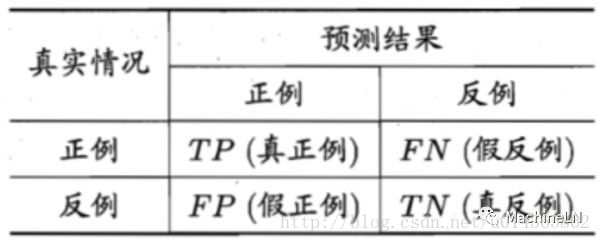
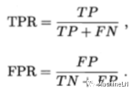
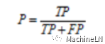
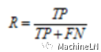

前沿
===

机器学习解决的问题和李航老师统计学习方法所描述的统计学问题不谋而合。李老师定义为统计学习三要素：方法=模型+策略+算法。这不光是统计学习必经之路，这也是ML、DL三大关键所在，如果你这三块系统化了以后，都可以往里套。

学习机器学习必由之路：***模型***；***策略***；***算法***。

那么我的理解：

模型
---
模型：官方一点就是：所要学习的条件概率或决策函数；譬如一个数学问题就是你针对解决问题列的方程组，而对于统计学来说就是我们常见的：感知机、K近邻、贝叶斯、决策树、逻辑回归、SVM等，有人就会说这不都是机器学习模型啊，我可以告诉你还真是，在不同的领域叫法是有点差别的，在经济里的统计系那么就是统计模型，在cv，nlp就是ML模型，自己瞎猜的，如果不对欢迎指出；在DL中的模型就是CNN、RNN、DNN、RBM等等。

策略
--
策略：就是说你这个模型想让它按照怎么样的准则去学习，然后选择你认为的最优模型。（这地方为什么加个你认为，这就是关键，因为同一个模型有人最后只能做到98%，而有人做到99%，当然track很多，data augmentation还是必要的）其实策略就是我们通常说的损失函数（loss function）、代价函数（cost function）等，主要有：0-1损失函数，平方损失函数，绝对损失函数，对数损失函数，交叉熵等，其实这一些在推荐系统中也称之为相似度（也可以称为距离）的度量方法，简单一点像基于用户的相似度，基于商品相似度等，其实就是求的距离，那么求距离的方法就多了：欧式距离、马氏距离、汉明距离、余弦距离、皮尔逊距离等，其实很多东西都是相通的。如果你理解到这里我感觉你已经入门了，“昨夜西风调碧树，独上高楼，望尽天涯路”。（我这人喜欢吹牛逼，爱吹不要紧，一定要落实，否则前功尽弃，做自己做好自己）

当然李航老师书中还提到了经验风险和结构风险，结构风险其实就是加正则化，或者惩罚项，有：L1、L2、dropout等等。

算法
---
算法：通俗一点就是解决问题的方法，一提到算法大家很快想到的是：排序、贪心、最短路径、字符串匹配等等，而这里的算法是你选择的使策略最小化的方法，有最小二乘法、牛顿法（想多了解一些数学可以看看泰勒级数，有时面试会问到）、梯度下降等，同样你要选择适合你的模型的优化方法，ML和DL有很多优化方法，不要迷失了方向，适合自己的才是最好的。

总结
---
当你这三块都很了解了，那么你就可以启程远航了，恭喜你到了第二境界：“衣带渐宽终不悔，为伊消得人憔悴”，惭愧的是目前鄙人还停留在“昨夜西风调碧树，独上高楼，望尽天涯路”。


模型评估
===

提出问题
---

（1）为什么要评估模型？

其实我们去评估模型最终是为了，得到符合我们数据或者是业务的最优模型，但是这往往不是一蹴而就的，反而使得评估模型通常成了下一步我们调参或者调优的一个参考。

（2）评估模型有哪些方法？

通常很多书籍中不会将loss（MachineLN之三要素中策略，也就是你的损失函数、目标函数的值）作为模型的评估标准，反而loss是一个很重要的标准，他将左右你调参过程中的很多参数，并且可以成为你判定是否模型训练完成的标准，譬如我们看到loss一直波动比较大，我们很自然的会想到是你的学习率太大了吧，后来loss开始波动很大，回来慢慢的平稳下降，这可能是数据分布的影响，可能是你样本的预处理方式；个人喜欢看loss，而准确率有时候在很长时间里波动不会很大；看到这里不要迷糊，总之还是那句话自己去踩踩坑，比什么都重要。

模型评估的方法相比大家都不陌生，只要看过一些机器学习的基础知识都可以知道一些，我在想要不要再写一下呢，纠结中...

评价的方法有：

错误率(error rate)= a个样本分类错误/m个样本精度(accuracy)= 1 -错误率

误差(error)：学习器实际预测输出与样本的真是输出之间的差异（差异的标准可以定义为相似度或者距离）。

训练误差(training error)：即经验误差。学习器在训练集上的误差。

泛化误差(generalization error)：学习器在新样本上的误差。

真正例（True Positive，TP）：真实类别为正例，预测类别为正例。

假正例（False Positive，FP）：真实类别为负例，预测类别为正例。

假负例（False Negative，FN）：真实类别为正例，预测类别为负例。

真负例（True Negative，TN）：真实类别为负例，预测类别为负例。



 ROC： 纵轴：真正例率 TPR；横轴：假正例率FPR；

 

 AUC：ROC曲线下面的面积。

准确率，又称查准率（Precision，P）；

 

 召回率，又称查全率（Recall，R）：（例如在人脸检测中有多少人脸检测到了，漏掉了多少人脸）

 

 等；

上面基本上是分类模型的评价标准，而在回归模型中，一般都是通过距离或者相似度来衡量（欧氏距离等）。有点乱，可以去看看周老师的机器学习一书。


（3）不同的方法针对什么问题？

在（2）中回答过了。

（4）根据评估的结果如何调优？


* 当训练集的效果（准确率）上不去，和贝叶斯估计（人的表现）存在一定差距的时候：（1）增加模型的复杂度。 或者直接多加几层。（2）现在目前效果非常好的一些模型：resnet，inception等。（3）重新选择优化函数：AdamOptimizer，MomentumOptimizer，RMSPropOptimizer等等。

* 训练集效果表现好，测试集效果表现不好：（1）增加训练样本的数量。（2）正则化：L2范数，dropout等（dropout原理是什么呢？使随机使神经元失活，相当于把一个复杂的模型拆分开，测试后时候凑到一起，集成学习的思想，又刹不住闸了。。。）。（3）还要观察训练样本和测试样本的分布是否一致。（4）交叉验证。

* 还有像样本预处理：（1）归一化：img/255.0，img-0.5, img*2，将数据转化为[-1,1].（2）减去均值除以方差。（3）减去样本各通道的均值。

* 还有loss的选择啊，多标签单分类适合用softmax_cross_entropy（对于多标签多分类的要用多个softmax），多标签多分类常用sigmoid_cross_entropy。

* data augmentation。

* 还要注意BN的使用，学习率的选择，batch_size的大小。


（5）根据评估结果怎么判定模型训练完成？

很多人都说：loss不再怎么变化，或者准确率不再怎么变化，ML书中一般都是交叉验证选最好的，但是dl中往往是选择什么时候停止，其实真实的情况往往是这个样子的（如下图），开始模型是欠拟合的，随着迭代次数的增多，模型会慢慢收敛，但是过了一个点以后，会呈现过拟合，这种情况怎么调参？ 有哪些解决方法？ 哦，发现自己好烦，我同事和大家一样也很烦我，说我问题真多，哈哈。。。我在迁移学习过程中一般都是从更新最后一层参数开始，根据自己的数据量来判断要更新最后几层的参数，更新多了会过拟合，少了会欠拟合，当然你还可以设置正则化等等。

 

 （6）总结

模型评估还是很重要的，但注意不同的标准可能评估的结果有点差异，还想简单提一下，偏差和方差的问题，后面的学习中可能会用到，先看一下这张图（其实就是上面那张图），其实我们模型的误差Error = Bias + Variance + Noise。 鱼和熊掌不可兼得。

 

 深度模型简介
 ===

 先看一下DL的局限性，给你挖一些坑自己去填可好？

 （1）目前深度学习需要大量数据；

 （2）深度学习目前还是太表浅，没有足够的能力进行迁移；

 （3）迄今深度学习没有自然方式来处理层级架构；

 （4）迄今为止的深度学习无法进行开放推理；

 （5）迄今为止的深度学习不够透明；

 （6）迄今为止，深度学习并没有很好地与先验知识相结合；

 （7）到目前为止，深度学习还不能从根本上区分因果关系和相关关系；

 （8）深度学习假设世界是大体稳定的，采用的方式可能是概率的；

 （9）到目前为止，深度学习只是一种良好的近似，其答案并不完全可信；

 （10）到目前为止，深度学习还难以在工程中使用；以上是Gary Marcus提出对深度学习的系统性批判，文章地址：https://arxiv.org/ftp/arxiv/papers/1801/1801.00631.pdf；

 那么我的问题又来了，以上10个方面为什么？搞明白了局限性再去思考值不值得学习，不要随大流，李开复老师有句话说的好：千万不要让别人驾驶你的生命之车，你要稳稳地坐在司机的位置上，决定自己何时要停、倒车、转弯、加速、刹车。可以参考别人的意见，但不要随波逐流。


简单说一下AI；AI=感知+理解+决策，目前的DL就是处理AI中的理解问题，无论是人脸检测、识别、行人检测、车辆检测、车道线、语音识别等等；感知就是获取图像、语音等的设备，决策像无人驾驶中来不及刹车时，左右是沟，中间是人，你怎么决策？损人利己？还是损己利人？哲学问题，扯得远了，但是真要商用，确实要面临的问题很多。

那么我的问题是？

（1）你学DL的目的是什么？

（2）你喜欢你现在的工作吗？DL对你现在的工作有什么帮助？

（3）如果那天DL热潮过了，你还有还什么技能可能养家糊口？

接下来不解答上面问题了，而是看一个手写体识别的代码，带你进入word世界：

咱们顺着代码的流程走一遍，估计会有很多坑，有坑时好事，正如学习再多tricks，不如猜一遍坑，（你废话真多，好了好了我不说了）后面的一些文章会逐渐来填起来；are you ready？

这是一段cnn的代码来决解手写体数字识别，（初学者会问了cnn是什么？有坑了？自己填去啊，哈哈）

（1）开始导入一下tensorflow，和去获取一下mnist的数据，用于后面的训练和测试

```
import tensorflow as tf
from tensorflow.example.tutorials.mnist import input_data
mnist = input_data.read_data_sets('MNIST_data/',one_hot=True, reshape=False)
```

（2）定义卷积：（问题：卷积是什么？ 为什么用卷积？作用是什么？）

```
def conv2d(image_input,w,b,name):
  return tf.nn.relu(tf.nn.bais_add(tf.nn.conv2d(image_input,w,strides=[1,1,1,1],padding='SAME'),b),name=name)
```

（3）定义池化：（问题和上面一样，别嫌我话多，面试时候会问到）

```
def pooling(featuremaps,kernel_size,name):
  return tf.nn.max_pool(featuremaps,[1,kernel_size,kernel_size,1],[1,kernel_size,kernel_size,1],padding='SAME')
```

(4)定义BN(问题和上面的一样)

```
def batch_nrom(featuremaps,is_train):
  return tf.layers.batch_normalization(featuremaps,training=is_train)

```

(5)参数初始化，卷积核参数，全连接参数

```
weights= {
  #[3,3,1,64]分别表示3*3*1的卷积核kernel,输入层有1个feature maps,输出层就有64个feature featuremaps
  'wc1':tf.get_variable(name='wc1',shape=[3,3,1,32],initializer=tf.contrib.layers.xavier_initializer_conv2d()),
  #[3,3,64,128]分别表示3*3*64的kernal，输出层有64个feature maps,输出层有128个feature featuremaps
  'wc2':tf.get_variable(name='wc2',shape=[3,3,32,64],initializer=tf.contrib.layers.xavier_initializer_conv2d()),
  'wc3':tf.get_variable('name'='wc3',shape=[3,3,64,64],initializer=tf.contrib.layers.xavier_initializer_conv2d()),
  'wc4':tf.get_variable('name'='wc4',shape=[3,3,64,128],initializer=tf.contrib.layers.xavier_initializer_conv2d()),
  #全连接层的参数个数设定的原则是经过卷积运算的输出结果feature map 的大小决定并且发生改变的
  #发生改变的原始是pooling层28/2/2/2/2/=2，所以曹成的结果改变
  'wd1': w_alpha*tf.Variable(tf.random_normal([2*2*128,256])),
  'wd2':w_alpha*tf.Variable(tf.random_normal([256,100])),
  'out':w_alpha*tf.Variable(tf.random_normal([100,10]))
}

#初始化偏置参数

biases = {
  'bc1':b_alpha*tf.Variable(tf.random_normal([32])),
  'bc2':b_alpha*tf.Variable(tf.random_normal([64])),
  'bc3':b_alpha*tf.Variable(tf.random_normal([128])),
  'bd1':b_alpha*tf.Variable(tf.random_normal([256])),
  'bd2':b_alpha*tf.Variable(tf.random_normal([100])),
  'out':b_alpha*tf.Variable(tf.random_normal([10]))
}

```


（6）最后一步组织起来数据

```

def constructNet(image,weights,biases,is_traing):
#首先将图转化为28*28*1的rensor
images=tf.reshape(image,[-1,28,28,1])
#第一个卷积层conv1
conv1 = conv2d(images,weights['wc1'],biases['bc1'],'conv1')
conv1 = batch_norm(conv1,is_training)
conv1 = tf.nn.relu(conv1)
#conv1 = tf.nn.dropout(conv1,_dropout)
conv1 = pooling(conv1,2,'pool1')

#建立第二个卷积层
conv2 = conv2d(conv1,weights['wc2'],biases['bc2'],'conv2')
conv2 = batch_norm(conv2,is_training)
conv2 = tf.nn.relu(conv2)
#conv2 = tf.nn.dropout(conv2,_dropout)
conv2 = pooling(conv2,2,'pool2')

#建立第三个卷积层
conv3 = conv2d(conv2,weights['wc3'],biases['bc3'],'conv3')
conv3 = batch_norm(conv3,is_training)
conv3 = tf.nn.relu(conv3)
#conv3 = tf.nn.dropout(conv3,_dropout)
conv3 = pooling(conv3,2,'pool2')


#建立第四个卷积层
conv4 = conv2d(conv3,weights['wc4'],biases['bc4'],'conv4')
conv4 = batch_norm(conv4,is_training)
conv4 = tf.nn.relu(conv4)
#conv4 = tf.nn.dropout(conv4,_dropout)
conv4 = pooling(conv4,2,'pool4')

#建立全连接层1

dense1 = tf.reshape(conv4,[-1,weights['wd1'].get_shape().as_list()[0]])
dense1 = tf.matmul(dense1,weights['wd1'])+biases['bd1']
dense1 = batch_norm(dense1,is_training)
dense1 = tf.nn.relu(dense1)

#全连接层2

dense2 = tf.nn.relu(tf.matmul(dense1,weights['wd2'])+biases['bd2'])

#输出层，最后出处层不用relue的操作
out = tf.matmul(dense2,weights['out']) + biases['out']
return out

```

（7）训练模型，其中含有了（机器学习三要素中的模型、策略、算法；还有机器学习之模型评估中的loss和准确率），有了上面的基础，下面代码就好理解了。


```
def train(num_batches, batch_size, learning_rate):
  #上面定义模型
  logits = constructNet(x,weights,biases,is_training)
  #建立策略:损失函数，此处使用softmax交叉熵处理
  model_loss = tr.reduce_mean(tf.nn.softmax_cross_entropy_with_logits(logits=logits,labels=y))
  update_ops = tf.get_collection(tf.GraphKeys.UPDATE_OPS)
  with tf.control_dependencies(updata_ops):
    train_opt = tf.train.AdamOptimizer(learning_rate).minimize(model_loss)

  #定义模型评估
  correct_prediction = rf.equal(tf.argmax(logits,1),tf.argmax(y,1))
  accuracy = tf.reduce_mean(tf.cast(correct_prediction,tf.float32))

  #下面开始训练模型
  with tf.Session() as sess:
    sess.run(tf.global_variables_initializer())
    for batch_i in range(num_batches):
      batch_xs, batch_ys = mnist.train.next_batch(batch_size)

      # 分割
      sess.run(train_opt,{x:batch_xs,y:batch_ys,is_training:True})

      # 迭代计算准确率
      if batch_i % 100 == 0:
        loss, acc = sess.run([model_loss,accuracy],{x:minist.validation.image,y:mnist.validation.labels,is_training:False})
        print('Batch:{:>2}:Validation loss:{:>3.5f},Validation accuracy:{:>3.5f}'.fromat(batch_i,loss,acc))
      elif batch_i%25 == 0:
        loss, acc = sess.run([model_loss,accuracy],{x:batch_xs,y:batch_ys,dropoutP:1.,is_training:False})
        print('Batch:{:>2}:Training loss:{:>3.5f}, training accuracy:{:>3.5f}'.fromat(batch_i,loss,acc))

  acc = sess.run(accuracy,{x:mnist.validation.images,y:mnist.validation.labels,is.training;False})

  print('Final validation accuracy:{:>3.5f}'.format(acc))

  acc = sess.run(accuracy,{x:mnist.test.images,y:mnist.test.labels,is_training:False})

  print('Final test accuracy:{:>3.5f}'.format(acc))

  correct = 0
  for i in range(100):
    correct += sess.run(accuracy,feed_dict={x:[mnist.test.image[i]],y:[mnist.test.labels[i]],is_training:Flase})

  print('Accuracy on 100 sample:',correct/100)


```


（8）一些参数及占位符号

```
image_size = 784 #28*28
class_num = 10 # 0~10

#image的placehoder
x = tf.placehoder(tf.float32,[None,28,28,1])
#label的placehoder
y = tf.placehoder(tf.float32,[None,class_num])

is_training= tf.placeholder(tf.bool)

num_batches=800
batch_size=64
learning_rate=0.001

train(num_batches,batch_size,learning_rate)

```

运行上面代码得到如下的结果

结果中随着loss会慢慢降低，而准确率会突变


说明一些衰减是需要正则化还修改，框架如下：

```
def fully_connected(prev_layer,num_units,)
  layer = tf.layers.dense(prev_layer,num_units,use_bias=False,activation=None)
  layer = tf.layers.batch_normalization(layer,training=is_training)
  layer = tf.nn.relu(layer)
  return layers

def conv_layer(prev_layer,layer_depth,is_training):
  strides = 2 if layer_depth % 3 == 0 else 1
  conv_layer = tf.layers.conv2d(prev_layer,layer_depth*16,3,strides,'same',use_bias=True,activation=None)
  conv_layer = tf.layers.batch_normalization(conv_layer,training=is_training)
  conv_layer = tf.nn.relu(conv_layer)
  return  conv_layer

def constructNet(image,weights,biases,is_trainging):
  inputs = tf.reshape(images,[-1,28,28,1])
  layer = inputs
  for layer_i in [1,2,4]:
    for n in range(2):
      layer = conv_layer(layer,layer_i,is_training)
    layer = tf.nn.max_pool(layer,ksize=[1,3,3,1],strides=[1,2,2,1],padding='SAME')
    #过滤卷积层
    orig_shape = layer.get_shape().as_list()
    layer = tf.reshape(layer,shape=[-1,orig_shape[1]*orig_shape[2]*orig_shape[3]])
    #增加全连接层
    layer = fully_connected(layer,100,is_training)
    #创建一个输出结果
    logits,=tf.layers.dense(layer,10)
```

DL中的CNN解析
===

主要问题：

嫌字太多直接看图，或者简单总结为cnn参数少好学习。

卷积神经网络是在神经网络的理论基础上形成的深度学习网络，它是一种特殊的多层神经网络。而传统的神经网络是一个全连接的网络结构（后面会提到），它上一层的每一个神经元与下一层的每一个神经元均有连接。这种结构有以下缺点：1、在处理声音和图像数据的时候，由于声音和图像的输入维度较高，包含数百个以上的变量，例如，输入图像的像素是100×100，假设隐含层要学习100维的特征 (即隐含层有 100 个神经元)，那么全连接网络就要学100×100×100个参数，即100万个权重参数，这样的网络结构在使用BP算法训练的时候，不但训练速度慢，而且需要的训练样本的数量也越多，若训练样本数量不足，会产生过拟合现象，学习得到的模型没有实用性。2、传统神经网络的结构对输入数据的特点的考虑不足，以图像识别为例，将同一幅图像做很小的位移，传统神经网络对其会很敏感，会当成是不同的图像，无法根据训练过程对该类数据特征进行优化处理。3、传统神经网络因为与输入数据是全连接的，无法识别训练数据中的局部区域特征，可是卷积神经网络可以单独学习识别该局部区域特征。

==>看一下图（借用大神的图）吧： 主要看第一个（10的12次幂）和第四个（10k）图的参数数量相差10的8次幂倍，已经到了亿级别了。（local conv意思是每个卷积核是不同的，也就是后面提到的它不是权值共享）


（2）cnn的结构是怎么样子的？

下面是最经典的cnn结构，如果你关注cnn发展过程，是这样子的：LeNet5->AlexNet->VGG->Inception_v1(v2,v3)->resnet->Inception_v4->xception->resnet_v2->Inception_resnet等等，还有一些移动端的小模型（mobilenet、shuffleNet）


* 1. 学过数字图像处理的应该学过卷积，像sobel算子等一些边缘检测，像一些均值滤波、中值滤波等等，只是这个卷积核我们称为fliters；但是和卷积神经网络中是不一样的，cnn中的卷积核往往是很多个，并且卷积中的卷积核值是通过学习得到的。卷积的流程：以一个很简单的图示展示卷积的流程：（下面只是一个简单的演示，真实情况下一般都是m个输入n个输出，对应[m,n,kernel_size,kernel_size]）


* 2. 池化流程，在一个给定的区域内，譬如2*2的区域取最大值（最大池化）、平均值（平均池化），（还有随机池化等）然后设置步长一般为2（就是下一步3*3的区域走到哪里），这样遍历完后，图像大小则会变为原来的二分之一。下面是最大池化和平均池化。


（3）cnn中各层的含义是什么？

卷积层的作用：
---

* 1. 权值共享，减少训练参数；一个卷积核与 输入map的不同区域做卷积时，它的参数是固定不变的。在CNN里，这叫做权值更享，那么为什么说减少训练参数呢？ 没有对比不能说少了或者多了，在上面的为什么提出cnn中已经解释了。

* 2. 不同的卷积核可以提取不同的特征；


池化层的作用：
---

减少参数。通过对卷积后的特征图降维，有效减少后续层需要的参数，但是下面的才是内涵所在：

* 1. 使构建更深层次的网络变得可行；

* 2. 使得filters获得更多的全局和contextual（上下文）信息；

* 3. 使训练可行，也可以说使得训练变得更高效，主要是针对深层次的网络结构来说；

* 4. 使得 特征map大小和数量进行更好的选择（权衡）。例如，就用输入到全连接层的前一层conv来说，特征map太大的话，特征数量就不易太多，通过pooling，使得特征map变小，特征map数量就可以更多。

（那么为什么要特征map更多呢？好处在哪里？）

答：因为每个特征map对应一个filters，特征map越多对应更多的filters，而不同的filters提取的是图像中不同方面的特征，也就是说filters越多对图像不同特征的提取越多。

* 5. 还有局部旋转不变性哦，其中像素在邻域发生微小位移时，池化层的输出是不变的。这就使网络的鲁棒性增强了，有一定抗扰动的作用。

最后层：全连结层（FC）
---

这个简单提一下，水太深；

* 1. FC在整个卷积神经网络中起到“分类器”的作用；

* 2. 目前由于全连接层参数冗余（仅全连接层参数就可占整个网络参数80%左右），像ResNet和GoogLeNet等均用全局平均池化（GAP）取代FC来融合学到的深度特征，最后用softmax等损失函数作为网络目标函数训练模型。

* 3. FC越来越不被看好。

DL中CNN应用
===

今天我们来研究cnn的源码，不用dl框架，前边文章已经对卷积、池化、全连结、前向传播、后向传播等做了铺垫，还少了激活函数(稍微提一下，使解决非线性成为可能，同时选择不当会导致梯度后向传播失败的问题)、BN(解决训练过程中数据弥散、加速训练，抗过拟合、弥补激活函数造成梯度后向传播失败的问题)等文章，后面会慢慢填起来。


开始填充代码：


```
#首先处理卷积部分的函数设计

def conv2(X,k):
  #获取输入二维矩阵的大小，多少行，多少列，行对应高，列对应宽
  #使用后面的for循环，通过训练计算卷积；
  x_row, x_col = X.get_shape
  #获取卷积核的大小，用于获取X矩阵块，用于卷积运算；
  k_row, k_col = k.shape
  #因为卷积时候考进矩阵下方，或者矩阵右边的地方不能进行卷积计算
  #假设矩阵的一行中的倒数第二个像素，而卷积核大小为5*5，那么获取卷积的卷积块就到了卷积外边
  #为了处理这种情况，padding就用来做这个的，给矩阵打补丁
  ret_row, ret_col = x_row-k_row+1,x_col-k_col+1
  #定义一个空矩阵，保存返回值，这里可以注意到，输入矩阵和输出矩阵大小是一样的，输出矩阵有一部分是0，不是卷积后的结果
  ret = np.empty((ret_row,ret_col))
  #下面是for训练的结果，进行二维矩阵的卷积
  for y in range(ret_row):
    for x in range(ret_col):
      #通过循环的方法获得二维矩阵中卷积核大小相同的区域，用于下面的矩阵乘法
      sub = X[y:y+l_row,x:x+k_col]
      ret[y,x] = np.sum(sub*k)
  return return

```


```

#矩阵旋转180度
def rot180(in_data):
  ret = in_data.copy()
  #获取矩阵大小减1，目的是在翻转过程中防止翻转到外边，所以内翻
  yEnd = ret.shape[0]-1
  xEnd = ret.shape[1]-1
  #下面是翻转的代码，将数据分为四部分，将左上右下换一个，将左下右上换一个
  for y in range(ret.shape[0]/2):
    for x in range(ret.shape[1]):
      ret[yEnd-y][x]= ret[y][x]
  for y in range(ret.shape[0]):
    for x in range(ret.shape[1]/2):
      ret[y][xEnd-x]= ret[y][x]
  return ret

```

```
#padding前边也提到了，就是给矩阵打补丁

def padding(in_data, size):
  cur_r, cur_w = in_data.shape[0],in_data.shape[1]
  new_r = cur_r + size * 2
  new_w = cur_w + size *2
  ret = np.zeros((new_r, new_w))
  ret[size:cur_r+ size,size:cur_w+ size] = in_data
  return return

# one-hot:假设有给个类型，分别输出为[0,0,1,0,0]对应位置为1；
# 如果是多标签就没有问题，解析一下数据多加一个循环就可以，类别是2,4；输出为[0,0,1,0,1];

def discreterize(in_data, size):
  num = in_data.shape[0]
  ret = np.zeros((num.size))
  for i,idx in enumerate(in_data):
    ret[i,idx] = 1
  return ret
```

```
#下面将开始CNN的工作
#定义一个类，初始化
class ConvLayer:
  #初始化，一般定义后面函数中需要的一些参数
  def __init__(self,in_channel,out_channel,kernel_size,lr=0.01,momentum=0.9,name='Conv'):
    self.w = np.random.random(in_channel,out_channel,kernel_size,kernel_size)
    #偏置初始化为0
    self.b = np.zeros((out_channel))
    self.layer_name = lr
    self.momentum = momentum

    self.prev_gridient_w = np.zeros_like(self.w)
    self.prev_gridient_b = np.zeros_like(self.b)

    #def _relu(self,x):
      #x[x<0] = 0
      #return x
      #下面写出前向传播，在前面的基础上铺垫的时候有说明

    def forward(self,in_data):
      #assume the first index is channel index
      print('conv forward:' + str(in_data.shape))
      # 获取batch_size 批量，通道数，行数和列数
      in_batch, in_channel,in_row,in_col = in_data.get_shape
      # 获取卷积之后输出的维度，和卷积核的大小（一般为行数列数相同），输入的维度要保持和in_data的维度一致；
      out_channel,kernal_size = self.w.shape[1],self.w.shape[2]
      #定义输出，(batch-size,通道数，矩阵大小)，为什么-kernal_size + 1 前面解释过，因为有些像素不能被覆盖的因素造成的不能卷积
      self.top_val = np.zeros((in_batch,out_channel,in_row-kernel_size+1,in_col - kernel_size + 1))
      self.bottom_val = input_data

      #下面就是CNN的卷积，代码不难理解
      for b_id in range(in_batch):
        for o in range(out_channel):
          for i in range(in_channel):
            #调用开始定义的卷积，对于batch中的每一个输入矩阵进行卷积相加；
            self.top_val[b_id,o] += conv2(in_data[b_id,1],self.w[i,o])
          self.top_val[b_id, o] +=self.b[o]
      return self.top_val
```


```

  #后向传播

  def backward(self,residual):
    in_channel,out_channel,kernel_size = self.w.get_shape
    # residual 就是CNN的灵敏度，通过这个值，就好理解下面流程根据数据一步一步的推导；
    in_batch = residual.shape[0]
    # gradient_b
    # 偏执的偏导数，就是对灵敏度求和
    gradient_b = residual.sum(axis=3).sum(axis=2).sum(axis=0)/self.batch_size
    # gradient_w
    # 权重的偏导数，就是对灵敏度与矩阵的每一个path区域卷积，
    self.gradient_w = np.zeros_like(self.w)
    for b_id in range(in_batch):
      for i in range(in_channel):
        for o in range(out_channel):
          self.gradient_w[i,o] += conv2(self.bottom_val[b_id],residual[o])
    self.gradient_w /= self.batch_size的大小

    #gradient_x
    #下面就是计算回传的灵敏度，只要将激活函数单独分出去，
    gradient_x = np.zero_like(self.bottom_val)
    for b_id in range(in_batch):
      for i in range(in_channel):
        for o in range(out_channel):
          gradient_x[b_id,i] += conv2(padding(residual,kernel_size -1),rot180(self.w[i,o]))
    gradient_x /= self.batch_size

    #upadate
    #更新参数
    self.prev_gradient_w = self.prev_gradient_w * self.momentum - self.gradient_w
    self.w += self.lr * self.prev_gradient_w
    self.prev_gradient_b = self.prev_gridient_b * self.momentum - self.gradient_b
    self.b += self.lr * self.prev_gradient_b
    return gradient_x

```


```
#全连接层

class FCLayer:
  def __init__(self, in_num, out_num, lr = 0.01, momentum=0.9):
    self._in_num = _in_num
    self._out_num = _out_num
    self.w = np.random.randn(in_num, out_num)
    self.b = np.zeros((out_num,1))
    self.lr = lr
    self.momentum = Momentum
    self.prev_grad_w = np.zeros_like(self.w)
    self.prev_grad_b = np.zeros_like(slef.b)
  #def _sigmoid(self, in_data):
  # return 1/(1+ np.exp(-in_data))
  #前向传播
  def forward(self, in_data):
    print('fc forward = %s'%str(in_data.shape))
    self.topVal = np.dot(self.w.T, in_data) + self.b
    self.bottomVal = in_data
    return self.top_val
  def backward(self, loss):
    batch_size = loss.shape[0]
    # residual_z = loss * self.topVal * (1-self.topVal)
    grad_w = np.dor(self.bottomVal, loss.T)/batch_size
    grad_b = np.sum(loss)/batch_size
    residual_x = np.dot(self.w, loss)
    self.prev_grad_w = self.prev_grad_w * momentum - grad_w
    self.prev_grad_b = self.prev_grad_b * momentum - grad_b
    self.w -= self.lr * self.prev_grad_w
    slef.b -= self.lr * self.prev_grad_b
    return residual_x

```
