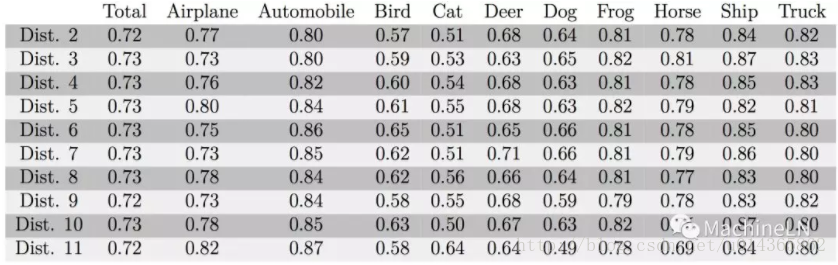
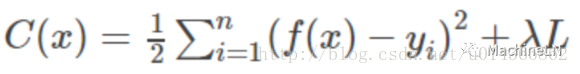

```
#最大池化层

class MaxPoolingLayer:
  def __init__(self, kernel_size, name= 'MaxPool'):
    self.kernel_size = kernel_size

  def forward(self,in_data):
    in_batch,in_channel,in_row,in_col = in_data.shape
    k = self.kernel_size
    out_row = in_row / k + (1 if in_row % k != 0 else 0)
    out_col = in_col / k + (1 if in_col % k != 0 else 0)

    self.flag = np.zeros_like(in_data)
    ret = np.empty((in_batch, in_channel, out_row, out_col))
    for b_id in range(in_batch):
      for c in range(in_channel):
        for oy in range(out_row):
            for ox in range(out_col):
              height = k if (oy + 1) * k <= in_row else in_row -oy * k
              width = k if (ox + 1) * k <= in_col else in_col -ox * k
              idx = np.argmax(in_data[b_id,c,oy*k:oy*k+height,ox*k])
              offset_r = idx / width
              offset_c = idx % width
              self.flag[b_id, c, oy * k: oy * k + offset_r, ox * k: ox * k +offset_c] = 1
              ret[b_id, c, oy, ox]= in_data[b_id, c, oy * k + offset_r, ox * k + offset_c]
    return ret

```


```
  #后向传播，主要查看灵敏度
  def backward(self, residual):
    in_batch, in_channel,in_row,in_col = self.flag
    k = self.kernel_size
    out_row,out_col = residual.shape[2],residual.shape[3]

    gradient_x = np.zeros_like(self.flag)
    for b_id in range(in_batch):
      for c in range(in_channel):
        for oy in range(out_row):
          for ox in range(out_col):
            height = k if (oy + 1) * k <= in_row else in_row - oy * k
            width = k if (ox + 1) * k <= in_col else in_col -ox * k
            gradient_x[b_id, c, oy * k +offset_r, ox * k + offset_c] = residual[b_id, c, oy, ox]
    gradient_x[self.flag == 0] = 0
    return gradient_x

```

```
# 卷积后的矩阵变为向量

class FlattenLayer:
  def __init__(self, name = 'Flatten'):
    pass
  def foward(self, in_data):
    self.in_batch, self.in_channel, self.r, self.c = in_data.shape
    return in_data.reshape(self.in_batch, self.in_channel * self.r * self.c)
  def backward(self, residual):
    return residual.reshape(self.in_batch, self.in_channel, self.r, self.c)

#softmax分类器
class Softmaxlayer：
  def __init__(self, name = 'Softmax'):
    pass
  def forward(self, in_data):
    exp_out = np.exp(in_data)
    self.top_val = exp_out/np.sum(exp_out, axis=1)
    return self.top_val
  #回传明敏度，开始就是计算差值
  def backward(self, residual):
    return self.top_val - residual


```


```
#建立网络

class Net:
  def __init__(self):
    self.layers = []
  #增加层数
  def addLayer(self,layer):
    self.layers.append(layer)
  #训练
  def train(self,trainData,trainLable,validDate,validLabel, batch_size,iteration):
    train_num = trainData.shape[0]
    for iter in range(iteration):
      print('iter = %s'%str(iter))
      for batch_iter in range(0,train_num,batch_size):
        if batch_iter + batch_size < train_num:
          self.train_inner(trainData[batch_iter:batch_iter+batch_size],trainlabel[batch_iter:batch_iter+batch_size])
        else:
          self.train_inner(trainData[batch_iter:train_num],trainLabel[batch_iter:train_num])
    print('eval=%s'%(str(self.eval(validData, validLabel))))
  def train_inner(self,data,label):
    lay_num = len(self.layers)
    in_data = data
    for i in range(lay_num):
      out_data = self.layers[i].forward(in_data)
      in_data = out_data
    residual_in = label
  def eval(self, data, label):
    lay_num = len(self.layers)
    in_data = data
    for i in range(lay_num):
      out_data = self.layers[i].forward(in_data)
      in_data = out_data
    out_idx = np.argmax(in_data, axis=1)
    label_idx = np.argmax(label, axis=1)
    return np.sum(out_idx == label_idx)/float(out_idx.shape[0])
```

```
#下面开始训练模型

if __name__ == '__main__':
  import struct
  from array import array

  def load_data(data_path, label_path):
    with open(label_path, 'rb') as file:
      magic, size = struct.unpack('>II',file.read(8))
      if magic != 2049:
        raise ValueError('Magic number mismatch,expected 2049,got %d'% magic)
      labels = array('B',file.read())
    with open(data_path,'rb') as file:
      magic,size,rows,cols = struct.unpack(">IIII",file.read(16))
      if magic != 2051:
        raise ValueError('Magic number mismatch, expected 2051,got %d' %magic)
      image_data = array('B',file.read())
    images = []
    for i in xrange(size):
      images.append([0]*rows*cols)
    for i in xrange(size):
      iamges[i][:] = image_data[i*rows*cols:(i+1)*rows*cols]
    return np.array(images),np.array(labels)

```


```
  train_feature_raw, train_label_raw = load_data('train.feat','train.label')
  valid_feature_raw, valid_label_raw = load_data('valid.feat','valid.label')
  train_feature = train_feature_raw.reshape(60000,1,28,28)
  valid_frature = valid_frature_raw.reshape(10000,1,28,28)
  train_label = discreterize(train_label_raw, 10)
  valid_label = discreterize(valid_label_raw, 10)

  net = Net()

  net.addLayer(ConvLayer(1,20,4,0.01,0.9))
  net.addLayer(ReLULayer())
  net.addLayer(MaxPoolingLayer(2))

  net.addLayer(ConvLayer(20,40,5,0.01,0.9))
  net.addLayer(ReLULayer())
  net.addLayer(MaxPoolingLayer(3))

  net.addLayer(FlattenLayer())
  net.addLayer(FCLayer(40*3*3,150,0.01,0.9))
  net.addLayer(ReLULayer())
  net.addLayer(FCLayer(150,10,0.01,0.9))
  net.addLayer(SoftmaxLayer())
  net.train(train_feature, train_label, valid_feature,valid_label,100,10)

```


激活函数
===

（1）什么是激活函数？

激活函数就是加在在神经元后的函数，下图所示（例如我们前边提到的在cnn卷积候连接的函数relu，还有Sigmoid、tanh、prelu等等），那么它有什么用呢？不加会怎么样？（2）中回答；

 

 当然你也最好了解下面概念，到提起梯度消失就容易理解了，正是因为这么饱和把梯度会传的时候越来越小，使得更新参数失败，整个网络瘫痪：

 


（2）激活函数的作用是什么？

简单说：为了解决非线性问题，不加激活函数只能处理线性问题。

下面图来自公众号忆臻笔记，一个用心在做的公众号。

先来看一个图：左侧的网络对应其下方的数学表达式，是一个线性方程（如果这里你还问为什么，那么see you），令其为0，可以画出一条直线，就是右侧的图了，右上方就是y>0的区域，左下方就是y<0的区域，对吧？ 那么它是线性的。

 

那么你再看下面这个图：网络结构用右侧的表达式表示。

 

你可以将右侧的表达式整理一下，其实它是这样的，你会发现原来是它也是线性的。

 

对，你想的没错，没有激活函数的网络只能处理线性问题（佩服大牛！），在看下面的图，在神经元后加上激活函数，至少可以保证输出是非线性的，那么能解决非线性问题吗？再往下走。


然后看下图，多个神经元的情况：


在看一下大神的图：


是的通过加上激活函数就可以解决这种非线性问题；


 （3）激活函数有哪些？

 详细介绍一个sigmod的激活函数：

 

  左侧是sigmoid函数图，右侧是sigmoid导数的函数图，由DeepLN之CNN权重更新中的公式5，可知在梯度回传过程中激活函数的影响梯度的问题，当数据落在sigmoid导数的红色区域时就会造成梯度很小，甚至梯度消失；这个问题可以通过改善激活函数来改善，当然也可以通过改变激活函数的输入x来改善，怎么改善？把x重新拉回到0附近不就ok了吗！那么你想到了什么？BN啊！！！那么你还有什么方法？修改激活函数啊，说过了，还有什么？resdual啊！！！对吗？哦，那么还可以有什么？当然真实使用的时候都是一起使用的，例如resdual+bn+relu等（当然bn还有其他作用，这只是其一）。


激活函数还有tanh函数、ReLU函数、ELU函数、PReLU函数等，为什么提取出来？ 解决什么问题？ 上面提到的左饱和、右饱和或者称为单侧抑制，对你理解这么激活函数有什么帮助？


batchnormalization分析说明
===

. 前言：

先看一个概念：

Covariance shift
——when the input distribution to a learning system changes, it is said to experience covariance shift.

在模型训练的时候我们一般都会做样本归一化（样本归一化作用会在下面文章介绍），在往多层神经网络传播时，前面层参数的改变，使得后面层的输入分布发生改变时，就叫Internal covariance shift。这会导致：其一，增加模型训练时间，因为样本分布变了，要调整 参数适应这种分布；其二：在MachineLN之激活函数文章中提到的使用sigmoid函数，梯度消失的问题；

2. BN （Batch Normalization）

BN：批量规范化：使得均值为0，方差为1；scale and shift：引入两个参数，从而使得BN操作可以代表一个恒等变换，为了训练所需加入到BN有可能还原最初的输入；看一下这个公式：


再看下面BN的两个公式，将上面公式带入，你会发现输入=输出，好尴尬啊！


BN的引入就是为了解决 样本分布改变训练训练慢、梯度消失、过拟合（可以使用较低的dropout和L2系数）等问题；

BN的具体推导，就不得不提到google的Batch Normalization Accelerating Deep Network Training by Reducing Internal Covariate Shift论文，看下图：


输入：m个样本x{1,...,m}，一般时卷积后输入激活函数前的数据；

输出：BN的处理结果；

上图中前向传播的公式应该很好理解；

下图是后向传播的公式：


再看一下训练过程：


可以解释为：（参考大神）

* 1.对于K维（通道数）的输入，假设每一维包含m个变量（这里可以理解为cnn的feature map），所以需要K个循环。每个循环中按照上面所介绍的方法计算γ与β。这里的K维，在卷积网络中可以看作是卷积核个数（卷积后的通道数），如网络中第n层有64个卷积核，就需要计算64次。

   需要注意，在正向传播时，会使用γ与β使得BN层输出与输入一样。

* 2.在反向传播时利用γ与β求得梯度从而改变训练权值（变量）。

* 3.通过不断迭代直到训练结束，求得关于不同层的γ与β。如网络有n个BN层，每层根据batch_size决定有多少个变量，设定为m，这里的mini-batcherB指的是特征图大小*batch_size，即m=特征图大小*batch_size，因此，对于batch_size为1，这里的m就是每层特征图的大小。

* 4.不断遍历训练集中的图片，取出每个batch_size中的γ与β，最后统计每层BN的γ与β各自的和除以图片数量得到平均直，并对其做无偏估计直作为每一层的E[x]与Var[x]。

* 5.在预测的正向传播时，对测试数据求取γ与β，并使用该层的E[x]与Var[x]，通过图中11:所表示的公式计算BN层输出。

   注意，在预测时，BN层的输出已经被改变，所以BN层在预测的作用体现在此处。

3. 总结

上面两本部分回答了BN的由来、BN的计算、BN的前后向传播


MachineLN之数据归一化
===

说到数据归一化，那么我的问题是：

1. 什么是数据归一化？

2. 为什么要进行数据归一化？

3. 数据归一化的方法有哪些？

看到这里你的答案是什么？下面是我的答案：（但是在使用的时候你要知道使用场景和哪些需要归一化，例如SVM、线性回归等需要归一化，决策树就不需要归一化；DeepLN之CNN权重更新（笔记）数据挖掘中的问题很犀利，很实用；）


1. 什么是数据归一化？

归一化可以定义为：归一化就是要把你需要处理的数据经过处理后（通过某种算法）限制在你需要的一定范围内。首先归一化是为了后面数据处理的方便，其次是保证模型运行时收敛加快。

下面以二维数据举个例子，下图是未归一化的数据：


下面两个图是通过不同算法进行归一化：


是的什么事样本归一化解释完了。

2. 为什么要进行数据归一化？

在我们模型训练的时候，数据在不同的取值范围内,例如x1取值[1:1000],特征x2的取值范[1:10],那么权重更新的时候，w1和w2值的范围或者比率会完全不同,下图中w和b对应w1和w2，可以看出函数的轮廓十分狭窄


那么再看一下，在这样的数据的损失函数使用梯度下降,必须使用一个非常小的学习比率,因为如果是在这个位置,梯度下降法可能需要更多次迭代过程。


数据进行归一化后的图是这个样子的：


梯度下降的图事这样子的：


到这里，大家知道了为什么进行数据归一化训练的重要性：可以使用较大的学习率，并且加速收敛。

3. 数据归一化的方法有哪些？ 适应的场景是什么？

（1） 线性归一化


在图像中可以简化为：x = ( (x / 255) -0.5 ) * 2, 归一化到[-1,1];

这种归一化方法比较适用在数值比较集中的情况。但是，如果max和min不稳定，很容易使得归一化结果不稳定，使得后续使用效果也不稳定，实际使用中可以用经验常量值来替代max和min。而且当有新数据加入时，可能导致max和min的变化，需要重新定义。

在不涉及距离度量、协方差计算、数据不符合正太分布的时候，可以使用第一种方法或其他归一化方法。比如图像处理中，将RGB图像转换为灰度图像后将其值限定在[0 255]的范围。

（2）标准差归一化

处理后的数据符合标准正态分布，即均值为0，标准差为1，其转化函数为：


u: 所有数据的均值， σ: 所有数据的标准差。

该种归一化方式要求原始数据的分布可以近似为高斯分布，否则归一化的效果会变得很糟糕。在分类、聚类算法中，需要使用距离来度量相似性的时候、或者使用PCA技术进行降维的时候，这种方法表现更好。

（3）非线性归一化

经常用在数据分化比较大的场景，有些数值很大，有些很小。通过一些数学函数，将原始值进行映射。该方法包括 log、指数，正切等。需要根据数据分布的情况，决定非线性函数的曲线，比如log(V, 2)还是log(V, 10)等。

例如：

通过以10为底的log函数转换的方法同样可以实现归一下：


用反正切函数也可以实现数据的归一化：


MachineLN之样本不均衡
===


1. 什么是样本不均衡？

样本不均衡：在准备训练样本的时候，各类别样本比例不等，有的差距可能比较小，有的差距则会比较大，以CIFAR-10为例：

CIFAR-10是一个简单的图像分类数据集。共有10类（airplane，automobile，bird，cat，deer，dog， frog，horse，ship，truck），每一类含有5000张训练图片，1000张测试图片。如下图：Dist. 1：类别平衡，每一类都占用10%的数据。Dist. 2、Dist. 3：一部分类别的数据比另一部分多。Dist. 4、Dist 5：只有一类数据比较多。Dist. 6、Dist 7：只有一类数据比较少。Dist. 8： 数据个数呈线性分布。Dist. 9：数据个数呈指数级分布。Dist. 10、Dist. 11：交通工具对应的类别中的样本数都比动物的多。


2. 为什么要解决样本不均衡？

训练网络使用的是CIFAR-10的结构，下面是测试结果：可以看出总的准确率表现不错的几组1,2,6,7,10,11都是大部分类别平衡，一两类差别较大；而表现很差的，像5,9可以说是训练失败了，他们的不平衡性也比前面的要强。


 那么再看一下，对样本少的数据进行过采样之后，测试结果：可以看到经过过采样将类别数量平衡以后，总的表现基本相当。（过采样虽然是一个很简单的想法，但是很OK，3中还将介绍海康威视ImageNet2016竞赛经验）

 


 想必到这里可以看到样本均衡的重要性了吧。


3. 解决样本不均衡有哪些方法？

解决不均衡问题的方式有很多：

（1）可以将数据进行扩增： （这些方法有时候也可以勉强做为数据不均衡的增强方法，如果训练时候各类样本都已经用了以下的方法进行data augmentation，那么样本不均衡就选其他方法来做吧）

进行颠倒，或者变换得到新的结果

（2） 可以借鉴一下海康威视的经验：


以图中的例子来说，步骤如下：首先对原始的图像列表，按照标签顺序进行排序；然后计算每个类别的样本数量，并得到样本最多的那个类别的样本数。根据这个最多的样本数，对每类随机都产生一个随机排列的列表；然后用每个类别的列表中的数对各自类别的样本数求余，得到一个索引值，从该类的图像中提取图像，生成该类的图像随机列表；然后把所有类别的随机列表连在一起，做个Random Shuffling，得到最后的图像列表，用这个列表进行训练。每个列表，到达最后一张图像的时候，然后再重新做一遍这些步骤，得到一个新的列表，接着训练。Label Shuffling方法的优点在于，只需要原始图像列表，所有操作都是在内存中在线完成，非常易于实现。

另外也可以按照同样的方式对多的样本进行欠采样；


（3）还可以用Weighted samples，给每一个样本加权重，样本多的类别每个的权重就小些，样本少的类别每个的权重就大些，这样无论样本是否均衡，在Loss Function中每类的影响力都一样的。


（4）还可以：再过采样之后使用K-fold交叉验证，来弥补一些特殊样本造成的过拟合问题，（K-fold交叉验证就是把原始数据随机分成K个部分，在这K个部分中选择一个作为测试数据，剩余的K-1个作为训练数据。交叉验证的过程实际上是将实验重复做K次，每次实验都从K个部分中选择一个不同的部分作为测试数据，剩余的数据作为训练数据进行实验，最后可以把得到的K个实验结果平均。）


1. 什么是过拟合？

不同的人提到过拟合时会有不同的含义：

（1） 看最终的loss，训练集的loss比验证集的loss小的多；

（2）训练的loss还在降，而验证集的loss已经开始升了；

（3）另外要提一下本人更注重loss，你过你看的是准确率，那么也OK，适合自己的才是最好的，正所谓学习再多tricks，不如踩一遍坑；

* 在第一种（1）中验证集的loss还在降，是不用太在意的。（2）中的overfitting如下图，在任何情况下都是不行滴！

* 和过拟合相对应的是欠拟合，如下图刚开始的时候；可以参考MachineLN之模型评估。


2. 为什么要解决过拟合问题？

过拟合对我们最终模型影响是很大的，有时候训练时间越长过拟合越严重，导致模型表现的效果很差，甚至崩溃；由上图我们也能看出来解决过拟合问题的必要性。


3. 解决过拟合有哪些方法？

（1）正则化

正则化的思想十分简单明了。由于模型过拟合极有可能是因为我们的模型过于复杂。因此，我们需要让我们的模型在训练的时候，在对损失函数进行最小化的同时，也需要让对参数添加限制，这个限制也就是正则化惩罚项。

假设我们的损失函数是平方损失函数：


加入正则化后损失函数将变为：



L1范数：


L2范数：


加入L1范数与L2范数其实就是不要使损失函数一味着去减小，你还得考虑到模型的复杂性，通过限制参数的大小，来限制其产生较为简单的模型，这样就可以降低产生过拟合的风险。

那么L1和L2的区别在哪里呢？L1更容易得到稀疏解：直接看下面的图吧：（假设我们模型只有 w1,w2 两个参数，下图中左图中黑色的正方形是L1正则项的等值线，而彩色的圆圈是模型损失的等值线；右图中黑色圆圈是L2正则项的等值线，彩色圆圈是同样模型损失的等值线。因为我们引入正则项之后，我们要在模型损失和正则化损失之间折中，因此我们取的点是正则项损失的等值线和模型损失的等值线相交处。通过上图我们可以观察到，使用L1正则项时，两者相交点常在坐标轴上，也就是 w1,w2 中常会出现0；而L2正则项与等值线常相交于象限内，也即为 w1,w2 非0。因此L1正则项时更容易得到稀疏解的。 ）


而使用L1正则项的另一个好处是：由于L1正则项求解参数时更容易得到稀疏解，也就意味着求出的参数中含有0较多。因此它自动帮你选择了模型所需要的特征。L1正则化的学习方式是一种嵌入式特征学习方式，它选取特征和模型训练时一起进行的。

（2）Dropout

先看下图：Dropout就是使部分神经元失活，这样就阻断了部分神经元之间的协同作用，从而强制要求一个神经元和随机挑选出的神经元共同进行工作，减轻了部分神经元之间的联合适应性。也可以这么理解：Dropout将一个复杂的网络拆分成简单的组合在一起，这样仿佛是bagging的采样过程,因此可以看做是bagging的廉价的实现（但是它们训练不太一样,因为bagging,所有的模型都是独立的,而dropout下所有模型的参数是共享的。）；


Dropout的具体流程如下：

* 对l层第 j 个神经元产生一个随机数 ：


* 将 l 层第 j 个神经元的输入乘上产生的随机数作为这个神经元新的输入：


* 此时第 l 层第 j 个神经元的输出为：


* 注意：当我们采用了Dropout训练结束之后，应当将网络的权重乘上概率p得到测试网络的权重。

（3）提前终止

由第一副图可以看出，模型在验证集上的误差在一开始是随着训练集的误差的下降而下降的。当超过一定训练步数后，模型在训练集上的误差虽然还在下降，但是在验证集上的误差却不在下降了。此时我们的模型就过拟合了。因此我们可以观察我们训练模型在验证集上的误差，一旦当验证集的误差不再下降时，我们就可以提前终止我们训练的模型。

（4）bagging 和其他集成方法

其实bagging的方法是可以起到正则化的作用,因为正则化就是要减少泛化误差,而bagging的方法可以组合多个模型起到减少泛化误差的作用；在深度学习中同样可以使用此方法,但是其会增加计算和存储的成本。

（5）深度学习中的BN

深度学习中BN也是解决过拟合的有效方法：可以参考之前的文章：DeepLN之BN。

（6）增加样本量 （MachineLN之样本不均衡中介绍的数据增强的方法）


在实际的项目中，你会发现，上面讲述的那些技巧虽然都可以减轻过拟合，但是却都比不上增加样本量来的更实在。为什么增加样本可以减轻过拟合的风险呢？这个要从过拟合是啥来说。过拟合可以理解为我们的模型对样本量学习的太好了，把一些样本的特殊的特征当做是所有样本都具有的特征。举个简单的例子，当我们模型去训练如何判断一个东西是不是叶子时，我们样本中叶子如果都是锯齿状的话，如果模型产生过拟合了，会认为叶子都是锯齿状的，而不是锯齿状的就不是叶子了。如果此时我们把不是锯齿状的叶子数据增加进来，此时我们的模型就不会再过拟合了。（这个在最近的项目里常用）因此其实上述的那些技巧虽然有用，但是在实际项目中，你会发现，其实大多数情况都比不上增加样本数据来的实在。


展望：深度学习系列再更新几篇后要暂时告一段落，开始总结传统机器学习的内容：KNN；决策树；贝叶斯；Logistic回归；SVM；AdaBoost；K-means等的理论和实践；中间穿插数据结构和算法（排序；散列表；搜索树；动态规划；贪心；图；字符串匹配等）；再之后我们重回Deep learning；


MachineLN之优化算法
===

1. 什么是优化算法？

关于优化算法的内容在MachineLN之三要素已经提到过，就是三要素中的算法：就是那个使策略（损失函数）最小化的方法，或者说通过迭代的方法（优化算法）计算损失函数的最优解。


2. 优化算法作用是什么？

简单说优化算法作用就是，用来调节模型参数，进而使得损失函数最小化，（此时的模型参数就是那个最优解）目前优化算法求解损失函数的最优解一般都是迭代的方式。（可以看一下下面两个图不同的优化算法，在寻找最优解的过程，还有鞍点问题）

* 如果是凸优化问题，如果数据量特别大，那么计算梯度非常耗时，因此会选择使用迭代的方法求解，迭代每一步计算量小，且比较容易实现。

* 对于非凸问题，只能通过迭代的方法求解，每次迭代目标函数值不断变小，不断逼近最优解。

* 因此优化问题的重点是使用何种迭代方法进行迭代，即求迭代公式。


3. 优化算法有哪些？

深度学习中常用的优化算法是梯度下降，着重介绍，一般来说，梯度下降算法有三种变种，它们之间的区别是使用多少数据来计算目标函数的梯度。取决于数据的大小，我们在参数更新的精度和花费的时间进行平衡。

* Batch gradient descent

   批量梯度下降是一种对参数的update进行累积，然后批量更新的一种方式。这种算法很慢，并且对于大的数据集并不适用；并且使用这种算法，我们无法在线更新参数。

* Stochastic gradient descent

   随机梯度下降是一种对参数随着样本训练，一个一个的及时update的方式。这种方法迅速并且能够在线使用；但是它频繁的更新参数会使得目标函数波动很大。

* Mini-batch gradient descent

   吸取了BGD和SGD的优点，每次选择一小部分样本进行训练。

尽管Mini-batch gradient descent算法不错， 它也不能保证收敛到好的值，并且带来了新的挑战：

* 很难选择合适的学习率。过小的学习率会使得收敛非常缓慢；多大的学习率会发生震荡甚至发散。

* 学习率相关的参数只能提前设定，无法使用数据集的特性

* 所有的参数更新都使用相同的学习率

* 如何跳出局部最小

下面是梯度下降的一系列文章：

（1）SGD 随机梯度下降，下面提到的深度学习的优化算法都是基于此展开；


（2）带动量（momentum）的SGD

虽然随机梯度下降仍然是非常受欢迎的优化方法，但其学习过程有时会很慢。 动量方法旨在加速学习，特别是处理高曲率、小但一致的梯度，或是 带噪声的梯度。动量算法积累了之前梯度指数级衰减的移动平均，并且继续沿该方向移动。


SGD方法的一个缺点是，其更新方向完全依赖于当前的batch，因而其更新十分不稳定。解决这一问题的一个简单的做法便是引入momentum。momentum即动量，它模拟的是物体运动时的惯性，即更新的时候在一定程度上保留之前更新的方向，同时利用当前batch的梯度微调最终的更新方向。这样一来，可以在一定程度上增加稳定性，从而学习地更快，并且还有一定摆脱局部最优的能力。

带动量（Momentum）的SGD特点：

* 下降初期时，使用上一次参数更新，下降方向一致，乘上较大的能够进行很好的加速

* 下降中后期时，在局部最小值来回震荡的时候，，使得更新幅度增大，跳出陷阱

* 在梯度改变方向的时候，能够减少更新 总而言之，momentum项能够在相关方向加速SGD，抑制振荡，从而加快收敛

（3）Nesterov 动量  SGD


首先，按照原来的更新方向更新一步（棕色线），然后在该位置计算梯度值（红色线），然后用这个梯度值修正最终的更新方向（绿色线）。上图中描述了两步的更新示意图，其中蓝色线是标准momentum更新路径。其实，momentum项和nesterov项都是为了使梯度更新更加灵活，对不同情况有针对性。

但是，人工设置一些学习率总还是有些生硬，接下来介绍几种自适应学习率的方法 ：

（4）AdaGrad(AdaGrad)算法：在参数空间中更为平缓的倾斜方向会取得 更大的进步。


说明一：大多数方法对于所有参数都使用了同一个更新速率。但是同一个更新速率不一定适合所有参数，比如有的参数可能已经到了仅需要微调的阶段，但又有些参数由于对应样本少等原因，还需要较大幅度的调动。Adagrad就是针对这一问题提出的，自适应地为各个参数分配不同学习率的算法。

说明二：AdaGrad是第一个自适应算法，通过每次除以根号下之前所有梯度值的平方和，从而使得步长单调递减。同时因为cache的变化与每个维度上的值有关，所以此方法可以解决各个维度梯度值相差较大的问题。对于每个参数，随着其更新的总距离增多，其学习速率也随之变慢。

特点：

* 前期较小的时候， regularizer较大，能够放大梯度

* 后期较大的时候，regularizer较小，能够约束梯度

* 适合处理稀疏梯度

缺点：

* 由算法8.4可以看出，仍依赖于人工设置一个全局学习率

* 设置过大的话，会使regularizer过于敏感，对梯度的调节太大

* 中后期，分母上梯度平方的累加将会越来越大，使，使得训练提前结束

（5）RMSProp 算法


简单的说，RMSProp对于AdaGrad的改进在于cache的更新方法。不同于不断的累加梯度的平方，RMSProp中引入了泄露机制，使得cache每次都损失一部分，从而使得步长不再是单调递减了。RMSprop可以算作Adadelta的一个特例

特点：

* 其实RMSprop依然依赖于全局学习率

* RMSprop算是Adagrad的一种发展，和Adadelta的变体，效果趋于二者之间

* 适合处理非平稳目标 - 对于RNN效果很好

RMSProp算法修改AdaGrad以在非凸设定下效果更好，改变梯度累积为指数加权的移动平均。

AdaGrad旨在应用于凸问题时快速收敛。AdaGrad根据平方梯度的整个历史收缩学习率，可能使得学习率在达到这样的凸结构前就变得太小了。

RMSprop使用指数衰减平均来丢弃遥远过去的历史，使其在找到凸结构后快速收敛，就像一个初始化于该碗装结构的AdaGrad算法实例。 相比于AdaGrad，使用移动平均引入了一个新的超参数ρ，用来控制移动平均的长度范围。

（6）Nesterov 动量  RMSProp


 （7）Adam 算法：Adam被看作结合RMSProp和具有一些重要区别的动量的变种。 首先，Adam中动量直接并入梯度一阶矩（指数加权）的估计。 其次，Adam包括偏置修正，修泽和那个从原点初始化的一阶矩（动量项）和（非中心的）二阶矩的估计。RMSProp也采用了（非中心的）二阶矩估计，然而缺失了修正因子。因此，RMSProp二阶矩估计可能在训练初期有很高的偏置。Adam通常被认为对超参数的选择相当鲁棒，尽管学习率有时需要遵从建议的默认参数0.001。 （本人比较喜欢用adam，总之适合自己才是最好的）


Adam(Adaptive Moment Estimation)本质上是带有动量项的RMSprop，它利用梯度的一阶矩估计和二阶矩估计动态调整每个参数的学习率。Adam的优点主要在于经过偏置校正后，每一次迭代学习率都有个确定范围，使得参数比较平稳。

特点：

* 结合了Adagrad善于处理稀疏梯度和RMSprop善于处理非平稳目标的优点

* 对内存需求较小

* 为不同的参数计算不同的自适应学习率

* 也适用于大多非凸优化 - 适用于大数据集和高维空间

看一下大神是如何总结的：


* 如果你的数据特征是稀疏的，那么你最好使用自适应学习速率SGD优化方法(Adagrad、Adadelta、RMSprop与Adam)，因为你不需要在迭代过程中对学习速率进行人工调整。

* RMSprop是Adagrad的一种扩展，与Adadelta类似，但是改进版的Adadelta使用RMS去自动更新学习速率，并且不需要设置初始学习速率。而Adam是在RMSprop基础上使用动量与偏差修正。RMSprop、Adadelta与Adam在类似的情形下的表现差不多。Kingma指出收益于偏差修正，Adam略优于RMSprop，因为其在接近收敛时梯度变得更加稀疏。因此，Adam可能是目前最好的SGD优化方法。

* 有趣的是，最近很多论文都是使用原始的SGD梯度下降算法，并且使用简单的学习速率退火调整（无动量项）。现有的已经表明：SGD能够收敛于最小值点，但是相对于其他的SGD，它可能花费的时间更长，并且依赖于鲁棒的初始值以及学习速率退火调整策略，并且容易陷入局部极小值点，甚至鞍点。因此，如果你在意收敛速度或者训练一个深度或者复杂的网络，你应该选择一个自适应学习速率的SGD优化方法。

个人总结：适合自己的才是最好的！

除梯度下降外的一些优化方法：（感兴趣的自行研究吧，牛顿法、拟牛顿法、最小二乘、启发式优化方法（模拟退火方法、遗传算法、蚁群算法以及粒子群算法等））


（8）二阶近似方法 ：与一阶方法相比，二阶方法使用二阶导 数改进了优化。最广泛使用的二阶方法是牛顿法。

* 牛顿法

牛顿法是二阶收敛的，梯度下降是一阶收敛的，所以牛顿法更快，如果更通俗地说的话，比如你想找一条最短的路径走到一个盆地的最底部，梯度下降法每次只从你当前所处位置选一个坡度最大的方向走一步，牛顿法在选择方向时，不仅会考虑坡度是否够大，还会考虑你走了一步之后，坡度是否会变得更大。所以，可以说牛顿法比梯度下降法看得更远一点，能更快地走到最底部。（牛顿法目光更加长远，所以少走弯路；相对而言，梯度下降法只考虑了局部的最优，没有全局思想。）。 （牛顿法是基于泰勒级数展开的（是不是很傻逼，不知死活的我去参加腾讯美团的面试被问到过各种数学问题，自己一脸傻逼，学的高数早还回去了，被迫自己又买了高数、线代、概率论的书，放在书架上压阵），这里意识到数学的重要性了，BAT的面试算法很看重数学）


根据wiki上的解释，从几何上说，牛顿法就是用一个二次曲面去拟合你当前所处位置的局部曲面，而梯度下降法是用一个平面去拟合当前的局部曲面，通常情况下，二次曲面的拟合会比平面更好，所以牛顿法选择的下降路径会更符合真实的最优下降路径。


注：红色的牛顿法的迭代路径，绿色的是梯度下降法的迭代路径。

优点：二阶收敛，收敛速度快；

缺点：牛顿法是一种迭代算法，每一步都需要求解目标函数的Hessian矩阵的逆矩阵，计算比较复杂。

* 共轭梯度方法


 共轭梯度法是介于梯度下降法与牛顿法之间的一个方法，它仅需利用一阶导数信息，但克服了梯度降法收敛慢的缺点，又避免了牛顿法需要存储和计算Hesse矩阵并求逆的缺点，共轭梯度法不仅是解决大型线性方程组最有用的方法之一，也是解大型非线性最优化最有效的算法之一。 在各种优化算法中，共轭梯度法是非常重要的一种。其优点是所需存储量小，具有步收敛性，稳定性高，而且不需要任何外来参数。

 

 下图为共轭梯度法和梯度下降法搜索最优解的路径对比示意图：

 


MachineLN之kNN
===


1. kNN介绍

kNN（K Nearest Neighbor）：存在一个样本数据集合，也称作训练样本集，并且样本集中每个数据都存在标签，即我们知道样本集中每一个数据与所属分类的对应关系。输入没有标签的数据后，将新数据的每个特征与样本集中数据对应的特征进行比较，然后算法提取样本集中特征相似数据（最近邻）的分类标签，一般来说我们只选择样本数据集中前k个最相似的数据，这就是k-近邻算法中的k的出处，通常k是不大于20的整数。最后，选择k个最相似数据中出现次数最多的分类，作为新数据的分类。

看一下下图：x是未知类别的，计算与w1，w2，w3相似度（距离），下图是取5个（k个）最相似的数据，然后从5个中选择出现次数最多的类别，作为x的类别。

 


其实，k值的选择至关重要，看下图，不宜太小不宜太大：


2. kNN中相似度量方法：

上面提到的相似度（还有推荐中的相似度），很多时候都是用距离来衡量，计算距离的方法有：

* 闵氏距离

   两观测点x和y间的闵氏距离是指两观测点p个变量值绝对差k次方总和的k次方根：


* 欧式距离

两观测点x和y间的欧式距离是指两观测点p个变量值绝对差平方总和的平方根：


可以看出，欧式距离是闵氏距离在k=2时的特例。

* 绝对(曼哈顿)距离

两观测点x和y间的绝对(曼哈顿)距离是指两观测点p个变量值绝对之差的总和：


 可以看出，绝对(曼哈顿)距离是闵氏距离在k=1时的特例。

 * 切比雪夫距离

两观测点x和y间的切比雪夫距离是指两观测点p个变量值绝对之差的最大值：


可以看出，切比雪夫距离是闵氏距离在k=无穷大时的特例

* 夹角余弦距离


可以看出夹角余弦距离是从两观测的变量整体结构相似性角度测度其距离的。夹角余弦值越大，其结构相似度越高。

当然除了以上的相似度量方法还有很多，马氏距离、交叉熵、KL变换等，都是可以衡量相似度的方法，但是要注意在什么情境用什么方法；


3. 注意的问题：

实际应用中，p个维度（特征）之间可能存在数量级的差异（这里也体现了数据归一化的重要性），数量级较大的维度对距离大小的影响会大于数量级小的变量。为了消除这种影响，统计学中常见的方法有标准分数法和极差法(有的称为极大-极小值法)。

* 标准分数法：


* 极差(极大-极小值法)法：


 另外，很多时候是这么做的，例如在DL中我们用CNN提取的特征作为kNN的样本；或者更传统一点，可以通过PCA降维后的结果作为kNN的样本；可以减少维度灾难；鄙人缺少此方便实战经验，写起来比较晦涩；


 4. kNN的优缺点

KNN的优缺点：

* 优点：

    1、思想简单，理论成熟，既可以用来做分类也可以用来做回归；

    2、可用于非线性分类；

    3、训练（计算时间）时间复杂度为O(n)；

    4、准确度高，对数据没有假设，对outlier不敏感；

* 缺点：
    1、计算量大（样本量大）；

    2、样本不平衡问题（即有些类别的样本数量很多，而其它样本的数量很少）；

    3、需要大量的内存；


5. 一些思考：

    一个是机器学习，算法基本上都比较简单，最难的是数学建模，把那些业务中的特性抽象成向量的过程，另一个是选取适合模型的数据样本。这两个事都不是简单的事。算法反而是比较简单的事。

    对于KNN算法中找到离自己最近的K个点，是一个很经典的算法面试题，需要使用到的数据结构是“较大堆——Max Heap”，一种二叉树。你可以看看相关的算法。
