MachineLN之kNN源码
===

```
#下面试knn的核心公式，
def classify0(inX, dataSet, labels, k):
  #在矩阵中为我们一般定义行和列，而在图像中我们定义宽和高，但是宽对于的是数据的列，高对应数据的行
  #首先获取样本集合的数量，给出所有样本的广播结果，进行向量和矩阵的加减晕眩
  dataSetSize = dataSet.shape[0]
  # data set size 行，1列，进行矩阵加减法；
  diffMat = tile(inX, (dataSetSize,1))-dataSetSize
  #下面的说民平方求和取根号，计算欧式距离，也就是计算样本之间的相似度；
  sqDiddMat = diffMat**2
  #求和
  sqDistance = sqDiffMat.sum(axis=1)
  #取根号
  distances = sqDistances**0.5
  # 对新样本和个类别样本计算距离后排序，然后返回索引值，默认是升序排列
  sortedDistIndicies = distances.argsort()
  #定义一个字典，排序后的k个值有类别的个数
  classCount = {}
  # 下面就是knn中的k值了
  for i in range(k):
    #下面就是根据排序后的索引建立的，取出对应样本的标签；
    voteIlabel =  labels[sortedDistIndicies[i]]
    # 统计排序后k个中个类别的数量，设个
    classCount[voteIlabel] = classCount.get(voteIlabel,0) +1
  #对于字典按照value进行排序
  '''
  def dict2list(dic:dict):
    #将自带你转化为列表
    keys = dic.keys()
    vals = dic.values()
    lst = [(keys,val) for key,val in zip(keys,vals)]
    return lst
  # lambda生成一个临时文件
  # d表示字典的每一个键值对应关系，d[0]为key, d[1]为value
  # reverse为True表示降序排列
  stat = sorted(dict2list(stat),key=lambda d:d[1], reverse = True)
  '''
  #降序排列
  sortedClassCount = sorted(classCount.iteritem(),key = operator.itemgetter(1),reverse=True)
  #取类别中数量最多的作为新的样本的类别
  return sortedClassCount[0][0]

#创建以恶简单的数据集
def createDataSet():
  #定义一个二维的数组，作为已经知道的标签样本集合计算计算
  group= array([[1.0,1.1],[1.0,1.0],[0,0],[0,0.1]])
  #下面就是标签
  labels =['A','A','B','B']
  return group,labels

#将文件中的样本数据作为矩阵；或者说是二位数组

def fiule2matrix(filename):
  fr = open(filname)
  #计算样本的数量，用户初始化保存样本集的二维数组了；
  numberOfLines = len(fr.readlines())
  # 定义返回样本的二维数组，只能取数据的第三列
  returnMat = zeros((numberOfLines,3))
  # 存在对应的标签
  classLabelVector = []
  fr = open(filename)
  index = 0
  #读取文件中的每一行数据；
  for line in fr.readlines():
    #去掉开头和结尾的符号的
    line = line.strip()
    #由于文件中各数据已经制定表格，所以制定进行分割；
    listFromLine = line.split('\t')
    #钱三个样本的数据，最后一个是标签
    returnMat[index,:] = listFromLine[0:3]
    classLabelVector.append(int(listFromLine[-1]))
    #记录数组中行的索引
    index += 1
  return returnMat,classLabelVector

#对数据做归一化分析
def autoNorm(dataSet):
  #计算样本中最小值和最大值，用于归一化结果；
  minVals = dataSet.min(0)
  maxVals = dataSet.max(0)
  ranges = maxVals - minVals
  #定义一个接收样本归一化后数据的数组，和样本集合的行数和列数是相同的；
  normDataSet = zeros(shape(dataSet))
  # 获取样本集合的数量，对于最小值和ranges进行广播；用于后面矩阵的减法和除法；
  m = dataSet.shape[0]
  #均一化之后，可以通过MachineLN之间样本进行均一化
  nromDataSet = dataSet -tile(minVals,(m,1))
  normDateSet = normDataSet/tile(ranges,(m,1))
  return normDateSet, ranges, minVals

#knn分类

def datingClassTest():
  #设置一个比率，在0到1之间，用于将样本集合设置多少个训练集合和测试数据
  hoRatio = 0.50
  #将样本变为矩阵，或者二维数组
  datingDataMat, datingLabels = file2matrix('datingTestSet2.txt')
  # 进行归一化，切忌用的时候不要忘记
  normMat, ranges, minVals = autoNorm(datingDataMat)
  # 获取样本的行数，就是样本量
  m = normMat.shape[0]
  #根据设置的比例，计算用于测试的样本的数量，同时用于训练的样本的数量就有了；
  numTestVecs = int(m*hoRatio)
  #用于就算错误的数量；
  errorCount = 0.0
  #训练计算每个测试样的标签值
  for i in range(numTestVecs):
    #取第i个测试样本，通过训练集合计算新样本的类别；
    if (classifierResult != datingLabels[i]):errorCount += 1.0
  print('the total error rate id %f'%(errorCount/float(numTestVecs)))
  print(errprCount)


#下面内容是处理图像数据；

def img2vector(filename):
  #用于存储每一个图片拉成的向量，这张图就有1024个维度；
  returnVect = zeros((1,1024))
  fr = open(filename)
  #二维矩阵的取值，或者二维数组取值；
  for i in range(32):
    #在文件中每行存入数据的一行像素；
    lineStr = fr.readline()
    for j in range(32):
      #取每一个像素；
      returnVect[0,32*i + j] = int(lineStr[j])
  return returnVect

##下面通过手写习题数字通过knn进行识别
def handwritingClassTest():
  #用于存储样本类别
  hwLabels = [a]
  #由于每张手写文字的图片房子一个文件夹中，要将所有文件生成一个样本集合；
  #获取文件夹中所有的文件；
  trainingFileList = listdir('trainingDigits')
  #获取文件数量
  m = len(trainingFileList)
  #定义一个数组，m行，1024个像素
  trainingMat = zeros((m,1024))
  #训练从文中读到的图像：
  for i in range(m):
    #读取每一个文件，根绝文件名字解析标签；
    filenameStr = trainingFileList[i]
    fileStr = fileNameStr.split('.')[0]
    classNumber = int(fileStr.split('_')[0])
    hwLabels.append(classNumStr)
    #将每个文件中存放的手写体数字，转化为向量；
    trainingMat[i,:] = img2vector('trainingDigits /%s'%fileNameStr)
  #对测试数据进行相同的操作
  testFileList = listdir('testDigits')
  errorCount = 0.0
  mTest = len(testFileList)
  for i in range(mTest):
    fileNameStr = testFIleList[i]
    fileStr = fileNameStr.split('.')[0]
    classNumStr = int(fileStr.split('_')[0])
    vectorUnderTest = img2vector('testDigits/%s'% fileNameStr)
    #第i个测试样本，通过训练集合上计算样本的类别
    classifierResult = classify0(vectorUnderTest,trainingMat,hwLabels,3)
    print(classifierResult.classNumStr)
    if(classifierResult != classNumStr): errorCount +=1.0
  print(errorCount)
  print(errorCount/float(mTest))


```

MachineLN之感知机
===

感知机虽然原理简单，但是不得不说他的意义重大，为什们呢？ 他是SVM的前身，后面的SVM是由此进化来的，其实两个结合起来学习会更好的，但是内容太多，SVM三境界，我可能还是停留在“昨夜西风调碧树，独上高楼，望尽天涯路”， 期待突破后面的两重天：“衣带渐宽终不悔，为伊消得人憔碎”， “众里寻他千百度，蓦然回首，那人却在，灯火阑珊处”。说起三境界不得不提佛家三境界：看山是山，看水是水；看山不是山，看水不是水；看山还是山，看水还是水。两者相通互补吧，才疏学浅不敢瞎说，理解还是有点困难的，突然感觉很多事情都是相通的，分久必合，合久必分？乱了乱了，我整天就知道瞎说，别介意。另外最近开始想这么一个问题：什么样的数据不适合用卷积？ 什么样的数据不适合用池化？ 什么样的数据只适合用全连接的结构？ 稍微有点眉目；感觉真的没有通用的网络！！！真是悲哀，以前提通用AI差点被骂死，出来DL后没人再提，只是说针对特定领域特定问题的AI；


看完文章记得最下面的原文链接，有惊喜哦！

说起感知机，那么我的问题：（根据MachineLN之三要素：模型、策略、算法）

（1）什么是感知机？（模型）

（2）感知机是如何学习的？（策略）

（3）感知机学习算法？（算法）

看到这里你的答案是什么？下面是我的答案：


1. 什么是感知机？

感知机是一个二类分类的线性分类模型。那么说起线性与非线性请参考MachineLN之激活函数;

感知机模型：

 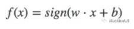

其中，w和b为感知机参数，w∈Rn叫做权值或权值向量，b∈R叫做偏置，w⋅x表示w和x的内积。感知机学习的目的就在于确定参数w和b的值。符号函数sign(x)不用多解释吧：

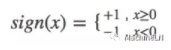

看到这里其实可以联系到两个模型：（1）逻辑回归：把sign改为sigmoid就是逻辑回归表达式；（2）SVM：表达式可以定义为一样；策略和算法差不远了去了（为了解决感知机的不足）；

几何解释：

可以用下面的线性方程表示：

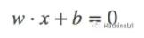


可以理解时一个特征空间中的一个超平面，其中w是超平面的法向量（为什么？），b是超平面的截距，这个超平面会把分成两部分，将点分为正、负两部分，看一下图吧：


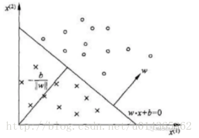

是的感知机就是在找这么一个能够将两个类别数据分开的超平面；并且超平面不是唯一的（参数更新的时候：样本的顺序是很大因素）；（SVM就是将感知机的不唯一变为唯一，后面我们会撸svm原代码，使用拉格朗日直接求解参数，和使用tensorflow的梯度下降求解参数，这时候损失函数要重新定义）

2. 感知机是如何学习的？

其实这里就是策略，就是常提的损失函数：用来衡量预测值和真实值的相似度的；有时候损失函数直接选择误分类点的总数更直观，但是这个损失函数不是参数的连续可导的函数（那么为什么非要可导：好像无论梯度下降，最小二乘法等都得可导吧，那么为什么非得用梯度下降最小二乘法等？有人说你这是瞎搞，哦nonono，这才是真正要探索的东西，你如果有好的方法不用非让损失函数可导，那么你就厉害了）；

先看一下下面的公式：应该很熟悉吧，点到直线的距离；

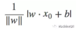

||w|| 是L2范数应该很明白了。

 但是，这里很重要：要弄明白所关心的是什么点到直线的距离作为函数，是分类正确的点？还是分类错误的点？ 提醒到这里大家就很明白，不说透的话是不是感觉云里雾里！那么说到误分类点，它是满足下面条件的：（为什么呢？ 因为我们预测的输出为[-1, 1],误分类点和真实值肯定异号，正确分类的点肯定同号）

 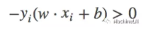

 那么我们可以重新定义损失函数：就是 误分类点的点到超平面的距离，注意是误分类！！！下一篇代码实现可以格外注意一下；用下面的式子定义：

 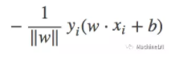

那么所有误分类点到超平面的总距离可以定义为：

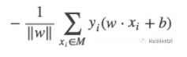

不考虑1/||w||, 得到感知机的损失函数为：

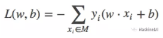

那么问题又来了，为什么不考虑呢？？？ 这也正是它的分类超平面不唯一的原因之一！（在SVM中为什么又考虑呢？）

个人理解：因为感知机任务是进行二分类工作，最终并不关心得到的超平面点的距离有多少（SVM格外关心哦！）（所以我们才可以不去考虑L2范式；）只是关心最后是否正确分类（也就是只考虑误分类点的个数）正如下面这个图（有点糙）x1,x2是一类，x3是一类，对于感知机来说是一样好的，而SVM就是那么最求完美的人，我只要最好！

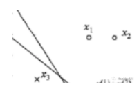


好了，策略有了，该研究通过什么方法来是损失函数最小了，下面介绍算法；


3. 感知机学习算法？

其实我们机器学习算法就是在求损失函数的最值，用数学表达式表示为：

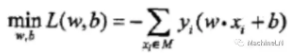

下面就是随机梯度下降的过程（随机梯度下降就是在极小化损失函数的过程中，每次只选一个误分类点，不使用所有的点）：

下面是损失函数的导数：也就是我们梯度下降中的那个梯度：


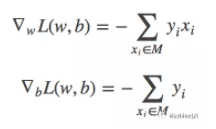

随机选一个误分类点，进行参数更新：

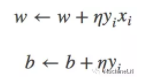


式中η(0<η≤1)是步长，又称为学习率，通过迭代的方式可以不断减小损失函数；（如果是看成数学问题，那么就严重了，说话得有根据，这里还要证明算法的收敛性。。。）

那么感知机原始算法的形式可以总结为：

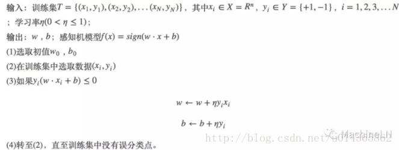


算法的对偶形式：（对偶？）

对偶形式的基本想法是，将w,b表示成为实例xi和标记yi的线性组合的形式，通过求解其系数而得到w和b。不失一般性，将初始值w0,b0设为0.对误分类点（xi,yi）通过

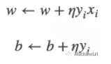


 逐步修该w,b，设修改了n次，则w,b关于（xi,yi）的增量分别为aiyixi和aiyi，这里ai=niη最终学习到的w,b可以表示为


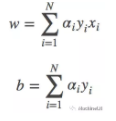

实例点更新次数越多，意味着它距离分离超平面越近，也就越难正确分类。换句话说，这样的实例对学习结果影响很大。

那么感知机算法的对偶形式可以总结为：


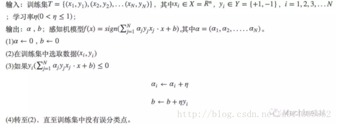


好好理解一下对偶，SVM也需要对偶一下的；

MachineLN之感知机源码
===

下面是加详细注释的感知机代码：又是截图，记住好代码都是敲出来的！下面代码要结合感知机原理来看：MachineLN之感知机

但是代码很方便理解，还有图示：

1. 原始形式的感知机算法：

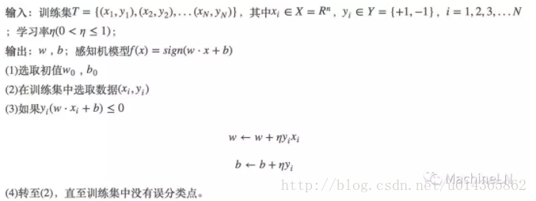


```
from numpy import *
import operator
import os

# 原型感知器的算法
# 简单例子说明感知器

def createDataSet():
  # 创建三组数据，及其对应的标签
  group = array([[3,3],[4,3],[1,1]])
  labels = [1,1,-1]
  return group, labels

#判断是不是模型的错误的分类点

def cal(row,trainLabel):
  #设置全局变量
  global w,b
  res = 0
  #样本每一个属乘以权重 + 偏置，计算预测值
  # 这里面可以使用样本矩阵的每一行，也就是样本中的一个样本；
  for i in range(len(row)):
    res += row[i] * w[i]
  res *= trainlabel
  return res

```

```
# 如果是误分点，更新权重

def update(row, trainLabel):
  global w, b
  # w[i] = w[i] + 一个样本中每一个值 * 标签 * 学习率； 这地方学习率可以默认为1
  for i in range(len(row)):
    w[i] += trainlabel * row[i]
  # 下面是偏执的更新
  b += trainLabel
```

```
#下面是感知机参数更新过程，其实就似乎按照上面的原理进行的

def perceptronClassify(trainGroup,trainLabels):
  global w,b
  #用来终止程序和保留最好的w,b;


```
